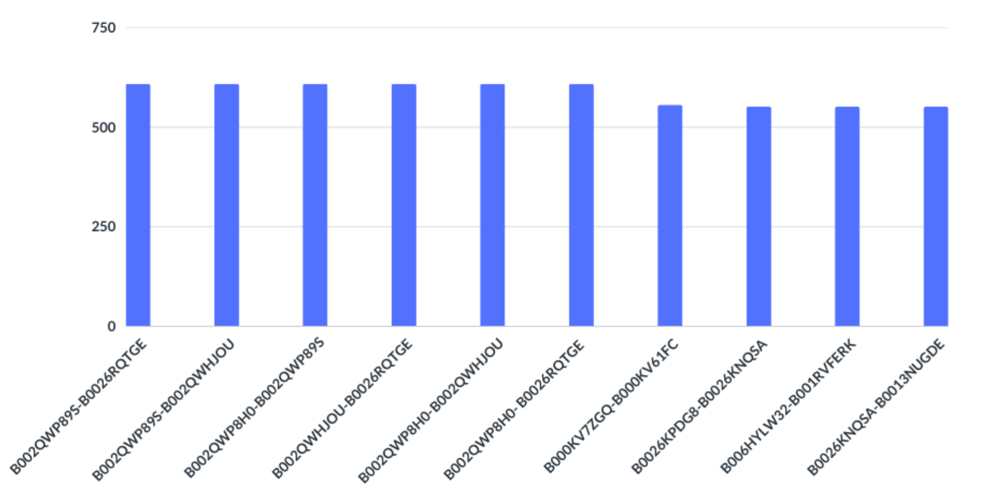

## An Example of the Potential of Data Analysis in Marketing

In this document, we explore the practical applications of Big Data processing solutions through a specific example. We will demonstrate how Spark's capabilities can be utilized for advanced data analysis by presenting a project developed using Java. This project serves as a concrete example of how Big Data processing systems can be applied in real-world scenarios. Leveraging Spark's power enables the efficient processing of large volumes of data in a short timeframe, unlocking new possibilities for marketing and business strategies.

### 2.2.1 Data

The application discussed starts with a public dataset provided by Amazon, related to the company's food sector. The primary goal is to identify and highlight pairs of products that have been frequently reviewed together. Specifically, the program focuses on detecting products that are often reviewed in pairs by a single user.

This process of identifying product pairs is driven by analyzing the reviews within the dataset. Using appropriate methods and algorithms, the program identifies which products are frequently associated with each other in user experiences and opinions. Such analysis can provide valuable insights into purchasing behaviors and interactions between different items within Amazon's food sector.

In addition to identifying product pairs, the program can also compute and present relevant statistics. These statistical data might include the frequency with which product pairs are reviewed together, the average ratings associated with these pairs, and considerations on the most common product categories among the identified pairs. Therefore, the program not only identifies the most frequently reviewed product pairs but also offers an analytical context that can be valuable for interpreting the results.

The incoming Amazon food dataset lists all reviews row by row; each row is separated into individual fields using commas, following a comma-separated values (CSV) format, and consists of the following schema:
- **Id:** Unique review identifier
- **ProductId:** Unique product identifier
- **UserId:** Unique user identifier
- **ProfileName:** User profile name
- **HelpfulnessNumerator:** Number of users who found the review helpful
- **HelpfulnessDenominator:** Total number of users who rated the review
- **Score:** Rating assigned to the review
- **Time:** Timestamp of the review
- **Summary:** Brief summary of the review
- **Text:** Full text of the review

This dataset organization allows for a clear and structured representation of the information collected from product reviews.

### 2.2.2 Logic

The Spark application consists of three main steps:

1. **Data Transformation:** The original Amazon food dataset is transformed into a PairRDD, where each user has a pair consisting of the user ID and a distinct list of products reviewed by that user. If a user has reviewed the same product multiple times, it will appear only once in the list of products reviewed by that user.

2. **Frequency Calculation:** The application calculates the frequency of each product pair reviewed together. The frequency of a product pair is determined by the number of users who have reviewed both products.

3. **Output Results:** The application outputs all product pairs that have been reviewed more than once, along with their respective frequencies. These pairs are sorted based on descending frequency.

To present the results effectively, the top 10 product pairs with the highest shared review frequencies are selected. This approach provides a clear and immediate overview of the most significant associations.

### 2.2.3 Code in Detail

Here's a step-by-step breakdown of the code:

1. **Library Imports:** Necessary libraries for using Apache Spark and support classes are imported, such as `JavaSparkContext`, `JavaRDD`, `JavaPairRDD`, `Tuple2`, `SparkConf`, `List`, etc.
   
2. **Input and Output Variables:** `inputPath` and `outputPath` are initialized using command-line arguments.

3. **SparkConf Creation:** A `SparkConf` object is created with the application configuration, and an application name is assigned using `setAppName`.

4. **JavaSparkContext Creation:** A `JavaSparkContext` object is created using the configuration defined in `SparkConf`. This object is essential for interacting with the Spark cluster.

5. **Input File Reading:** The input file's content is read using `textFile` from `JavaSparkContext`. The result is stored in a `JavaRDD<String>` object called `inputRDD`.

6. **Data Manipulation:** Various transformation operations are applied to the data, such as mapping reviews to a pair of "user id" and "product id", removing duplicates, and creating pairs of products reviewed together. These operations use Spark APIs like `mapToPair`, `distinct`, `groupByKey`, and `filter`.

7. **Sorting and Saving Results:** The results are further processed, sorted by descending frequency, and saved to the specified output folder.

8. **Retrieve and Print Top 10 Results:** The `take(10)` function is used on `finalRDD` to obtain the top 10 most relevant results. These results are converted to a list of strings and printed for convenience.

9. **Close JavaSparkContext:** The `JavaSparkContext` object is closed to terminate the interaction with the Spark cluster.

In summary, this code loads a review dataset, performs various manipulation and calculation operations using Spark functions, and provides a list of the top 10 results based on pairs of products reviewed together.

### 2.2.4 Results

In the context of the results, "pairs" refer to combinations of two products reviewed together by various users. These pairs are represented by two key elements:

1. **Number of Occurrences:** Indicates how many times the specific product pair was reviewed together by different users.
2. **Product ASIN Pair:** The ASINs of the specific products reviewed together.

We examine these data through a bar chart to provide a clearer visual representation of the information.

This bar chart shows the distribution of frequencies of product pairs reviewed together in our dataset. Each bar represents a product pair, while the vertical axis indicates the number of shared review occurrences for that specific pair.

The most frequently reviewed product pair was evaluated together 608 times, indicating a high level of connection between these two products. This high frequency suggests that these products are often purchased or used together by users. Overall, the chart provides a visual snapshot of relationships between product pairs based on the frequency of shared reviews.

### 2.2.5 Summary

This code demonstrates the significant impact that data analysis can have in uncovering subtle and meaningful connections within a vast dataset. By leveraging Apache Spark, the code efficiently utilizes parallel computing capabilities to process large quantities of data. Simplifying results within such a data-driven project is crucial as it allows for a clear and concise representation of complex information derived from data analysis.

In conclusion, this experiment not only exemplifies the power of Apache Spark in data analysis but also highlights the importance of adopting an analytical approach to fully leverage the resources that data can offer. The result is a better understanding of user behaviors, optimized business strategies, and an enhanced user experience.